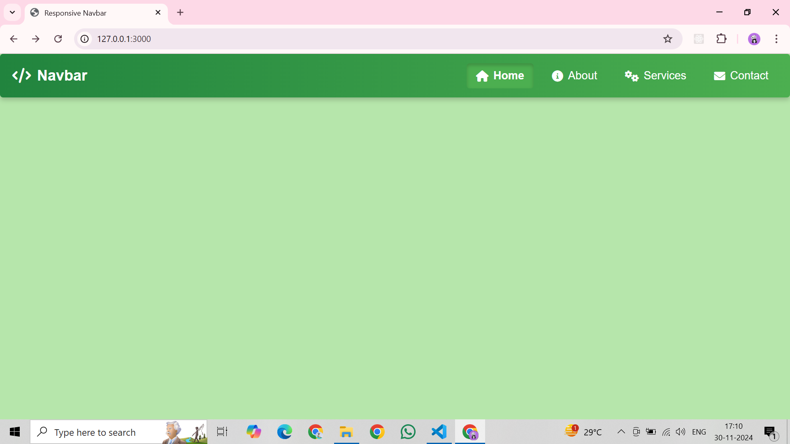
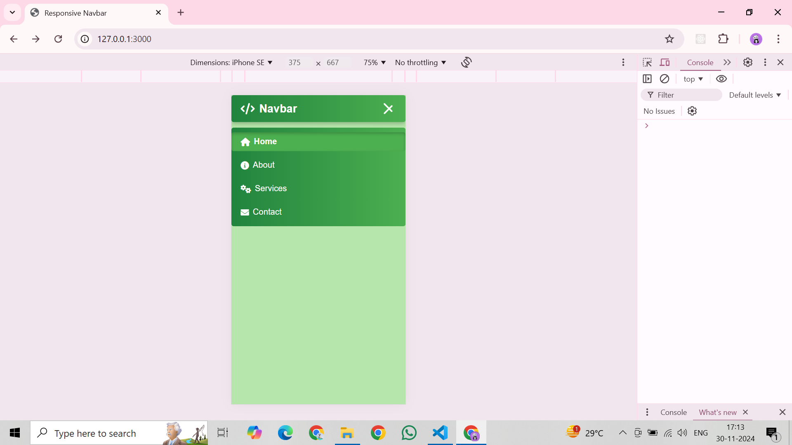

```markdown
# Responsive Navbar Project

A fully responsive and modern navigation bar built using **HTML**, **CSS**, and **JavaScript**. This project is designed with accessibility and user experience in mind, featuring a sticky header, hover animations, a collapsible hamburger menu for mobile, and smooth transitions.

## Features

- **Responsive Design**: Adapts seamlessly to all screen sizes, from desktop to mobile.
- **Sticky Navbar**: Remains fixed at the top of the viewport while scrolling for better navigation.
- **Smooth Interactions**:
  - Hover animations with scaling effects.
  - Smooth transitions for links and icons.
- **Hamburger Menu**: Collapsible menu for smaller screens with clean animations.
- **Gradient Background**: Eye-catching gradient design for the navbar.
- **Font Awesome Icons**: Enhances visual appeal by incorporating icons for menu items.
- **Minimal Code**: Clean, modular structure for easy customization.

## Technologies Used

- **HTML5**: For structuring the content.
- **CSS3**: For styling, animations, and responsive design.
- **JavaScript**: For adding interactivity, such as the mobile menu functionality.
- **Font Awesome**: For adding modern icons.

## Live Demo

You can view the live version of the project here:
[Responsive Navbar - Live Demo](https://MohdRaza216.github.io/responsive-navbar)

## Screenshots

### Desktop View:


### Mobile View:


## Setup Instructions

1. Clone this repository:
   ```bash
   git clone https://github.com/MohdRaza216/responsive-navbar.git
   ```
2. Navigate to the project folder:
   ```bash
   cd responsive-navbar
   ```
3. Open the `index.html` file in your browser to view the project locally.

## File Structure

```
responsive-navbar/
├── index.html       # Main HTML file
├── css/
│   └── style.css    # CSS for styling the navbar
├── js/
│   └── script.js    # JavaScript for interactivity
└── README.md        # Project documentation
```

## How It Works

### Desktop:
- The navbar is displayed as a horizontal menu with smooth hover animations.
- Links are styled with a gradient background and modern fonts.

### Mobile:
- A hamburger menu icon replaces the horizontal menu.
- Clicking the icon toggles a dropdown menu with slide-in animations.

### Sticky Navbar:
- The navbar sticks to the top of the page, providing easy access to navigation links while scrolling.

## Future Improvements

- Add submenus or dropdown functionality.
- Include more animation effects.
- Enhance accessibility for screen readers.
- Allow users to toggle between light and dark themes.

## License

This project is open-source and free to use under the [MIT License](LICENSE).

## Contribute

Feel free to contribute to this project by submitting issues or pull requests!
